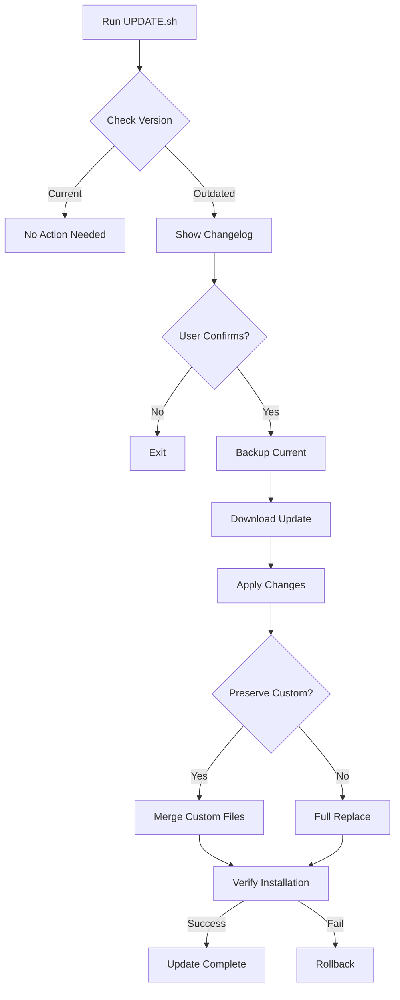

<!--
📁 FILE: /home/anthonycalek/projects/tmops_framework/CODE/.tmops/tmops-mcp/docs/internal/00_tmops_package_update_research.md
🎯 PURPOSE: Research and solution proposal for making tmops_v6_portable an updatable package
🤖 AI-HINT: Comprehensive analysis of package distribution options with recommended implementation approach
🔗 DEPENDENCIES: tmops_v6_portable/, INSTALL.sh, Git, GitHub
📝 CONTEXT: Addressing the need for framework updates to propagate to existing installations
-->

---
# Research Report: TeamOps Package Update System
# Version: 1.0.0
# Date: 2025-09-05
# Author: @claude-code

## Executive Summary

**Problem**: tmops_v6_portable is currently distributed by copying files directly into projects. Once installed, there's no mechanism to receive updates (bug fixes, new features, documentation improvements).

**Solution**: Implement a **Version-Tracked Update System** with automatic update checking and safe upgrade mechanism that preserves user customizations.

## Current State Analysis

### Distribution Method
- **Current**: `INSTALL.sh` copies files directly into project
- **Location**: Files copied to project root (tmops_tools/, instance_instructions/, etc.)
- **Version**: Semantic versioning exists (6.4.1) but not tracked in installations
- **Updates**: Manual - users must re-copy files

### Problems Identified
1. No way to know if updates are available
2. No safe update mechanism
3. User modifications get overwritten
4. No dependency management
5. No rollback capability

## Solution Options Evaluated

### Option 1: Git Submodules
**Pros:**
- Built into Git
- Version tracking automatic
- Easy updates via `git submodule update`

**Cons:**
- Complex for users unfamiliar with submodules
- Can cause merge conflicts
- Requires careful commit management
- Not portable to non-git projects

**Verdict**: ❌ Too complex for target users

### Option 2: GitHub Releases + Update Script
**Pros:**
- Clear version management
- Download specific versions
- Release notes available
- Works without git knowledge

**Cons:**
- Requires internet for updates
- Need to build distribution archives
- Manual update triggering

**Verdict**: ✅ Good balance of features

### Option 3: Symbolic Links to Central Install
**Pros:**
- Single source of truth
- Instant updates
- No duplication

**Cons:**
- Platform compatibility issues
- Breaks if central install moves
- Can't have per-project versions

**Verdict**: ❌ Too fragile

### Option 4: Package Manager (npm/pip)
**Pros:**
- Standard tooling
- Dependency management
- Version locking

**Cons:**
- Requires Node.js or Python
- Framework is bash-based
- Adds external dependencies

**Verdict**: ❌ Mismatched technology

## Recommended Solution: Version-Tracked Update System

### Core Components

1. **Version File** (`tmops_v6_portable/VERSION`)
   ```
   6.4.2
   ```

2. **Update Manifest** (`tmops_v6_portable/.update-manifest`)
   ```json
   {
     "version": "6.4.2",
     "installed_at": "2025-09-05T10:00:00Z",
     "source": "https://github.com/happycode-ch/tmops_framework",
     "branch": "main",
     "preserve_files": [
       "CLAUDE.md",
       "tmops_tools/custom_*.sh"
     ]
   }
   ```

3. **Update Script** (`tmops_v6_portable/UPDATE.sh`)
   - Check for updates
   - Download new version
   - Backup current installation
   - Apply updates safely
   - Preserve user modifications

4. **Version Check Integration**
   - Add version check to `init_feature_multi.sh`
   - Weekly reminder for updates
   - Show changelog for new versions

### Implementation Design

```bash
#!/bin/bash
# UPDATE.sh - TeamOps Framework Update System

# Features:
# 1. Check current vs latest version
# 2. Show what's new (changelog)
# 3. Backup current installation
# 4. Download and apply updates
# 5. Preserve user customizations
# 6. Rollback on failure

update_tmops() {
    local CURRENT_VERSION=$(cat VERSION)
    local LATEST_VERSION=$(curl -s https://api.github.com/repos/happycode-ch/tmops_framework/releases/latest | grep tag_name | cut -d'"' -f4)
    
    if [[ "$CURRENT_VERSION" == "$LATEST_VERSION" ]]; then
        echo "✅ Already on latest version: $CURRENT_VERSION"
        return 0
    fi
    
    echo "📦 Update available: $CURRENT_VERSION → $LATEST_VERSION"
    echo "📝 Changelog: https://github.com/happycode-ch/tmops_framework/releases/tag/$LATEST_VERSION"
    
    read -p "Update now? (y/n) " -n 1 -r
    if [[ $REPLY =~ ^[Yy]$ ]]; then
        # Backup current installation
        backup_installation
        
        # Download new version
        download_update "$LATEST_VERSION"
        
        # Apply update preserving customizations
        apply_update
        
        # Verify installation
        verify_update
    fi
}
```

### Update Process Flow



### File Structure

```
tmops_v6_portable/
├── VERSION                    # Version tracking
├── .update-manifest          # Installation metadata
├── UPDATE.sh                 # Update script
├── CHANGELOG.md             # Local changelog
├── .update-backup/          # Backup directory (git-ignored)
├── tmops_tools/
│   ├── check_updates.sh    # Version check utility
│   └── ...
└── ...
```

### Safety Features

1. **Automatic Backup**
   - Complete backup before updates
   - Timestamped backup directories
   - Easy rollback mechanism

2. **Preserve Customizations**
   - User-modified files detected
   - Custom scripts preserved
   - Configuration merging

3. **Verification**
   - Checksum validation
   - Installation testing
   - Rollback on failure

4. **Compatibility Check**
   - Breaking change warnings
   - Migration scripts for major versions
   - Deprecation notices

### User Experience

#### First Installation
```bash
# Install framework
./INSTALL.sh

# Creates VERSION file and .update-manifest
# Sets up update checking
```

#### Check for Updates
```bash
# Manual check
./UPDATE.sh --check

# Output:
# 📦 TeamOps Framework v6.4.2 installed
# 🔄 Checking for updates...
# ✨ New version available: v6.5.0
# 📝 View changelog: https://github.com/...
```

#### Apply Update
```bash
# Interactive update
./UPDATE.sh

# Automatic (CI/CD)
./UPDATE.sh --auto --backup
```

#### Rollback
```bash
# Restore previous version
./UPDATE.sh --rollback

# List backups
./UPDATE.sh --list-backups
```

### Version Compatibility

| Framework Version | Update Method | Notes |
|------------------|---------------|-------|
| < 6.4.2 | Manual reinstall | No update system |
| 6.4.2+ | UPDATE.sh | Full update support |
| 7.0.0+ | UPDATE.sh | Migration assistant |

### Implementation Tasks

1. **Phase 1: Core Infrastructure** (2 hours)
   - [ ] Create VERSION file
   - [ ] Create UPDATE.sh script
   - [ ] Add version checking logic
   - [ ] Implement backup system

2. **Phase 2: GitHub Integration** (1 hour)
   - [ ] Set up GitHub releases
   - [ ] Create release workflow
   - [ ] Add changelog automation
   - [ ] Test download mechanism

3. **Phase 3: Safety Features** (2 hours)
   - [ ] Implement file preservation
   - [ ] Add rollback capability
   - [ ] Create verification tests
   - [ ] Add migration scripts

4. **Phase 4: User Experience** (1 hour)
   - [ ] Update documentation
   - [ ] Add update notifications
   - [ ] Create troubleshooting guide
   - [ ] Test end-to-end flow

### Alternative: Git-Based Updates (Simpler)

For a simpler first implementation:

```bash
#!/bin/bash
# SIMPLE-UPDATE.sh - Git-based update

# Add upstream remote (first time only)
git remote add tmops-upstream https://github.com/happycode-ch/tmops_framework.git 2>/dev/null

# Fetch latest changes
git fetch tmops-upstream main

# Show what's new
echo "📦 Changes available:"
git log --oneline HEAD..tmops-upstream/main -- tmops_v6_portable/

# Apply updates to tmops_v6_portable only
read -p "Apply updates? (y/n) " -n 1 -r
if [[ $REPLY =~ ^[Yy]$ ]]; then
    # Backup current
    cp -r tmops_v6_portable tmops_v6_portable.backup
    
    # Checkout latest framework files
    git checkout tmops-upstream/main -- tmops_v6_portable/
    
    echo "✅ Updated to latest TeamOps version"
    echo "📁 Backup saved to tmops_v6_portable.backup"
fi
```

**Pros:**
- Very simple implementation
- Uses existing Git infrastructure
- Selective file updates
- Built-in version control

**Cons:**
- Requires Git
- No custom file preservation
- Manual conflict resolution

## Recommendations

### Immediate Action (Quick Win)
1. Implement simple Git-based updater
2. Add VERSION file to track installations
3. Document update process

### Long-term Solution
1. Build full UPDATE.sh system
2. Set up GitHub releases
3. Add automated testing
4. Create migration framework

### Best Practices
1. **Semantic Versioning**: Strictly follow MAJOR.MINOR.PATCH
2. **Changelog Maintenance**: Update with every change
3. **Backward Compatibility**: Preserve for minor versions
4. **Migration Guides**: Provide for major versions
5. **Testing**: Automated update testing in CI

## Conclusion

The Version-Tracked Update System provides the best balance of:
- **Simplicity**: Easy for users to understand and use
- **Safety**: Backups and rollback capability
- **Flexibility**: Preserves customizations
- **Reliability**: Works across different environments

Starting with the simple Git-based approach allows immediate value while building toward the complete solution.

---

*Research Report Version: 1.0.0 | TeamOps Package Update System*