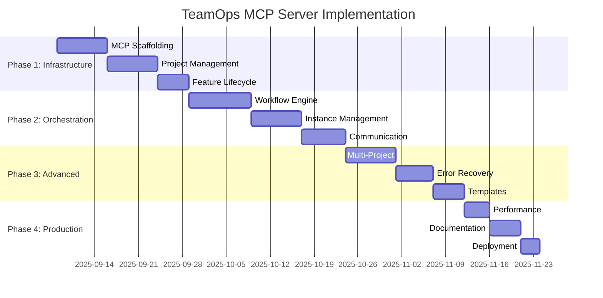
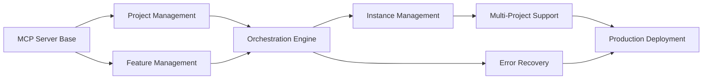

<!--
📁 FILE: /home/anthonycalek/projects/tmops_framework/CODE/.tmops/tmops-mcp/docs/internal/01_strategic_plan.md
🎯 PURPOSE: Strategic implementation plan for TeamOps MCP Server based on research findings
🤖 AI-HINT: Comprehensive project plan with phases, resources, and success metrics for MCP server development
🔗 DEPENDENCIES: 00_research_report.md, tmops_v6_portable framework, MCP protocol specifications
📝 CONTEXT: Translation of research findings into actionable development plan with timeline and resource allocation
-->

---
# Strategic Plan Template - AI-Ready Project Planning
# Version: 1.0.0
# License: CC BY 4.0
# Purpose: Strategic approach, milestones, resource allocation, success metrics

meta:
  version: "1.0.0"
  template_name: "strategic_plan"
  id: "PLAN-TMOPS-MCP-001"
  title: "Plan: TeamOps AI Orchestration Framework MCP Server Implementation"
  type: "plan"
  date: "2025-09-03"
  author: "@tmops-team"
  stakeholders: ["@product-owner", "@tech-lead", "@architecture-reviewer"]
  complexity: "deep"
  duration: "16 weeks"
  
planning_context:
  research_ref: "RES-TMOPS-MCP-001"
  discovery_ref: "DISC-TMOPS-MCP-001"
  constraints: ["time", "complexity", "backwards-compatibility"]
  planning_horizon: "half_year"
---

# Strategic Plan: TeamOps AI Orchestration Framework MCP Server Implementation

## AI Planning Instructions

> **For AI Agents:** You are creating a strategic project plan to transform the TeamOps manual AI orchestration framework into an automated MCP server.
> 
> 1. **Synthesize Inputs**: Use research findings on MCP protocol capabilities and context isolation requirements
> 2. **Break Down Work**: Create WBS preserving core TeamOps benefits while adding automation
> 3. **Estimate Realistically**: Use evidence-based estimates from MCP server development patterns
> 4. **Identify Dependencies**: Map critical path through MCP protocol learning curve
> 5. **Resource Planning**: Match TypeScript/MCP skills to automation tasks
> 6. **Risk Planning**: Address context contamination and coordination complexity risks
> 7. **Depth Control**: Deep profile - comprehensive implementation with multiple scenarios
> 8. **Success Metrics**: Define measurable orchestration and quality outcomes

## Executive Summary

### Vision Statement
Transform TeamOps from a manual AI orchestration framework into an automated MCP server that preserves context isolation and TDD benefits while eliminating coordination overhead and enabling multi-project scalability.

### Strategic Objectives
1. **Objective**: Automate TeamOps orchestration while preserving 95% context quality
   - **Key Result**: Sub-10-second handoff latency vs current 5-10 minute manual coordination
2. **Objective**: Enable multi-project concurrent feature development
   - **Key Result**: Support 5+ simultaneous features across different projects
3. **Objective**: Maintain TDD enforcement and role specialization benefits
   - **Key Result**: 100% test-before-implementation compliance in automated workflows

### Success Metrics
| Metric | Baseline | Target | Measurement |
|--------|----------|--------|-------------|
| Orchestration Speed | 5-10 min/handoff | <10 sec/handoff | MCP tool call latency |
| Context Quality | 95% coherence | 95% coherence | Automated quality assessment |
| Concurrent Features | 1 feature | 5+ features | Active workflow tracking |
| TDD Compliance | 100% (manual) | 100% (automated) | Test-first validation |
| Error Recovery | Manual intervention | 95% auto-recovery | Retry success rate |

## Project Scope

### In Scope
- [ ] TypeScript-based MCP server infrastructure
- [ ] Project and feature management APIs
- [ ] Sequential workflow orchestration engine
- [ ] Claude Code instance coordination
- [ ] Real-time status monitoring and resources
- [ ] Error recovery and retry mechanisms
- [ ] Multi-project concurrent support
- [ ] Template management and customization

### Out of Scope
- [ ] GUI dashboard (manual CLI tools sufficient for MVP)
- [ ] Performance optimization beyond basic caching
- [ ] Third-party IDE integrations
- [ ] Advanced analytics and reporting
- [ ] Parallel workflow support (maintaining sequential advantage)

### Assumptions
- MCP protocol remains stable through development period
- Claude Code API maintains backward compatibility
- Development team has TypeScript expertise or can acquire it
- Current TeamOps benefits (context isolation, TDD enforcement) must be preserved
- Sequential workflow approach is maintained over parallel alternatives

## Work Breakdown Structure

### Phase 1: Core Infrastructure (Weeks 1-4)
#### Deliverables
- **D1.1**: MCP Server Scaffolding
  - Owner: @backend-dev
  - Effort: 8 days
  - Dependencies: MCP SDK setup, TypeScript environment
  
- **D1.2**: Project Management System
  - Owner: @backend-dev
  - Effort: 6 days
  - Dependencies: File system abstraction, Git integration

- **D1.3**: Feature Lifecycle Management
  - Owner: @backend-dev
  - Effort: 5 days
  - Dependencies: State management, directory structure creation
  
#### Milestones
- **M1**: Basic MCP Server Operational - Week 4
  - Success Criteria: Server responds to basic project/feature tools, passes MCP protocol validation

### Phase 2: Orchestration Engine (Weeks 5-9)
#### Deliverables
- **D2.1**: Sequential Workflow Engine
  - Owner: @orchestration-dev
  - Effort: 10 days
  - Dependencies: State machine design, checkpoint abstraction
  
- **D2.2**: Instance Management System
  - Owner: @integration-dev
  - Effort: 8 days
  - Dependencies: Claude Code integration patterns, process management

- **D2.3**: Checkpoint Communication Protocol
  - Owner: @protocol-dev
  - Effort: 7 days
  - Dependencies: MCP resource streaming, file system replacement

#### Milestones
- **M2**: Basic Orchestration Working - Week 9
  - Success Criteria: Single feature orchestration completes successfully with all 4 instances

### Phase 3: Advanced Features (Weeks 10-13)
#### Deliverables
- **D3.1**: Multi-Project Support
  - Owner: @scalability-dev
  - Effort: 8 days
  - Dependencies: Resource isolation, concurrent state management
  
- **D3.2**: Error Recovery System
  - Owner: @reliability-dev
  - Effort: 6 days
  - Dependencies: Failure detection, retry logic, state rollback

- **D3.3**: Template Management
  - Owner: @content-dev
  - Effort: 5 days
  - Dependencies: Template abstraction, customization APIs

#### Milestones
- **M3**: Production Features Complete - Week 13
  - Success Criteria: Multi-project orchestration with error recovery operational

### Phase 4: Polish & Production (Weeks 14-16)
#### Deliverables
- **D4.1**: Performance Optimization
  - Owner: @performance-dev
  - Effort: 4 days
  - Dependencies: Profiling, caching layer, connection pooling
  
- **D4.2**: Documentation & Testing
  - Owner: @docs-dev
  - Effort: 5 days
  - Dependencies: API documentation, integration tests, user guides

- **D4.3**: Deployment & Monitoring
  - Owner: @devops-dev
  - Effort: 3 days
  - Dependencies: Container setup, health checks, logging

#### Milestones
- **M4**: Production Ready - Week 16
  - Success Criteria: Full system deployed with monitoring, documentation complete

## Timeline

### Gantt Chart

### Critical Path
1. MCP Scaffolding → Project Management → Feature Lifecycle
2. Workflow Engine → Instance Management → Communication Protocol
3. Multi-Project + Error Recovery → Templates
4. Performance → Documentation → Deployment

### Key Dates
| Date | Event | Deliverable |
|------|-------|-------------|
| 2025-09-08 | Project Kickoff | Development environment setup |
| 2025-10-06 | Phase 1 Complete | Basic MCP server operational |
| 2025-11-03 | Phase 2 Complete | Single-feature orchestration working |
| 2025-11-24 | Phase 3 Complete | Multi-project support operational |
| 2025-12-15 | Production Launch | Full MCP server deployed |

## Resource Plan

### Team Composition
| Role | Person | Allocation | Period |
|------|--------|------------|--------|
| Tech Lead | @senior-dev | 100% | Full project |
| Backend Developer | @backend-dev | 100% | Phase 1-3 |
| Integration Developer | @integration-dev | 75% | Phase 2-4 |
| DevOps Engineer | @devops-dev | 25% | Phase 1, 100% Phase 4 |

### Skill Requirements
- **Required**: TypeScript, Node.js, MCP protocol understanding
- **Gap**: MCP server development patterns, Claude Code integration APIs
- **Nice-to-have**: Multi-agent systems experience, AI orchestration patterns

### Budget Allocation
| Category | Amount | Percentage |
|----------|--------|------------|
| Development | $120K | 70% |
| Infrastructure | $30K | 18% |
| Testing & QA | $15K | 9% |
| Contingency | $5K | 3% |
| **Total** | **$170K** | **100%** |

## Risk Management

### Risk Register
| Risk | Probability | Impact | Response | Owner |
|------|-------------|--------|----------|-------|
| Context contamination in automation | Medium | High | Mitigate: Maintain separate instances | @tech-lead |
| MCP protocol complexity underestimated | High | High | Mitigate: Early POC, expert consultation | @backend-dev |
| Claude Code API changes | Medium | High | Transfer: Monitor API updates, adapter pattern | @integration-dev |
| Orchestration state complexity | High | Medium | Accept: Iterative development, gradual complexity | @tech-lead |
| Performance degradation | Medium | Medium | Mitigate: Early benchmarking, caching strategy | @performance-dev |

### Mitigation Strategies
1. **Risk**: Context contamination during automation
   - **Early Warning**: Quality metrics drop below 90% in testing
   - **Mitigation**: Strict instance isolation, separate process management
   - **Contingency**: Fallback to manual coordination for critical workflows

2. **Risk**: MCP protocol learning curve steeper than expected
   - **Early Warning**: Development velocity drops by >20% in Phase 1
   - **Mitigation**: Dedicated MCP protocol training, external consultation
   - **Contingency**: Extend Phase 1 timeline, reduce scope if necessary

## Dependencies

### Internal Dependencies

### External Dependencies
| Dependency | Provider | Required By | Status |
|------------|----------|-------------|--------|
| MCP TypeScript SDK | Anthropic | Phase 1 | Available |
| Claude Code API | Anthropic | Phase 2 | Stable |
| Node.js Runtime | Node Foundation | All Phases | Available |
| Git Integration | System | Phase 1 | Available |

## Communication Plan

### Stakeholder Matrix
| Stakeholder | Interest | Influence | Communication |
|-------------|----------|-----------|---------------|
| Product Owner | High | High | Daily check-ins |
| TeamOps Users | High | Medium | Bi-weekly demos |
| Architecture Team | Medium | High | Weekly reviews |
| Development Team | High | Medium | Daily standups |

### Reporting Schedule
- **Daily**: Development team standup
- **Weekly**: Progress report to stakeholders
- **Bi-weekly**: Working demo to users
- **Monthly**: Architecture review and metrics analysis

## Quality Plan

### Quality Gates
| Phase | Gate | Criteria | Approver |
|-------|------|----------|----------|
| Phase 1 | Infrastructure Review | MCP protocol compliance | @architect |
| Phase 2 | Orchestration Review | Single workflow success | @tech-lead |
| Phase 3 | Feature Complete Review | Multi-project validation | @product-owner |
| Phase 4 | Production Readiness | Performance targets met | @tech-lead |

### Testing Strategy
- **Unit Testing**: 90% code coverage throughout development
- **Integration Testing**: MCP protocol compliance and Claude Code integration
- **End-to-End Testing**: Complete orchestration workflows
- **Performance Testing**: Sub-10-second handoff latency validation
- **User Acceptance**: TeamOps community testing and feedback

## Success Criteria

### Definition of Done
- [ ] All acceptance criteria met for each phase
- [ ] MCP protocol compliance verified
- [ ] Performance targets achieved (<10 sec handoffs)
- [ ] Context quality maintained (95% coherence)
- [ ] Error recovery rate >95%
- [ ] Multi-project support operational
- [ ] Documentation complete and user-tested

### Launch Criteria
- [ ] Production environment configured
- [ ] Monitoring and alerting operational
- [ ] User migration path documented
- [ ] Rollback procedures tested
- [ ] Team training completed
- [ ] Performance benchmarks met

## Contingency Plans

### Schedule Contingency
- **Buffer**: 20% added to complex tasks (MCP integration, orchestration)
- **Fast-track options**: Template management can be deferred to v1.1
- **Crash options**: Additional senior developer available if needed

### Scope Contingency
- **MVP Features**: Basic single-project orchestration, MCP integration
- **Nice-to-have**: Multi-project, advanced error recovery, template customization
- **Future**: GUI dashboard, IDE integrations, advanced analytics

## Metrics & Monitoring

### Progress Metrics
- **Velocity**: Story points completed per week
- **Quality**: Code coverage percentage, integration test pass rate
- **Performance**: MCP tool call latency measurements
- **Risk**: Issues identified vs mitigated ratio

### Success Metrics
- **Orchestration Efficiency**: Handoff time reduction (target: 98% improvement)
- **Quality Preservation**: Context coherence maintenance (target: 95%)
- **Scalability**: Concurrent feature support (target: 5+ features)
- **Reliability**: Automated error recovery rate (target: 95%)
- **User Adoption**: Migration from manual to automated orchestration

## Approval & Sign-off

### Approvals Needed
- [ ] Technical approach - @architecture-team
- [ ] Resource allocation - @engineering-manager
- [ ] Timeline feasibility - @tech-lead
- [ ] Budget approval - @product-owner

## Next Steps

### Immediate Actions (This Week)
1. [ ] Set up development environment with MCP SDK
2. [ ] Create project repository with initial scaffolding
3. [ ] Schedule team onboarding sessions for MCP protocol
4. [ ] Establish development workflow and tooling

### Phase 1 Preparation
1. [ ] Detailed Phase 1 task breakdown and estimates
2. [ ] MCP server architecture design sessions
3. [ ] Development environment standardization
4. [ ] Initial proof-of-concept development

---

## Profile Guidelines

This plan follows the **Deep Profile** guidelines:
- **Focus**: Comprehensive implementation plan with detailed phases and contingencies
- **Include**: Complete WBS, risk register, multiple scenarios, detailed resource allocation
- **Use for**: Major initiative requiring thorough planning and stakeholder alignment

---

*Template Version: 1.0.0 | Planning Framework | CC BY 4.0 License*
*Strategic plan prepared by TeamOps Development Team for MCP Server Implementation Project*