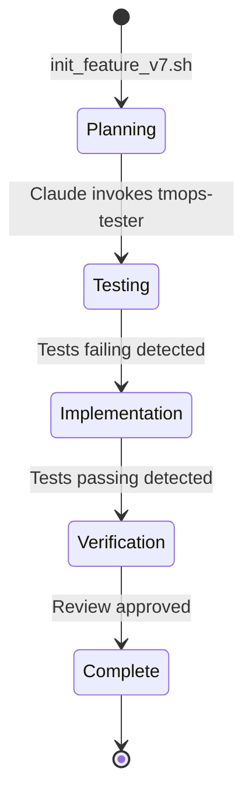

# TeamOps v7 Architecture

## Overview
TeamOps v7 represents a major architectural shift from manual orchestration to fully automated TDD workflow management using Claude Code's native capabilities.

## Core Components

### 1. Hooks System
Hooks are event-driven scripts that run at specific points in Claude's execution lifecycle.

#### Hook Types and Responsibilities

| Hook | Event | Purpose | Key Actions |
|------|-------|---------|-------------|
| PreToolUse | Before any tool execution | Role enforcement | Blocks unauthorized tool usage based on current role |
| PostToolUse | After tool execution | Phase detection | Detects test results and triggers phase transitions |
| SessionStart | Session initialization | Workflow setup | Initializes TeamOps state if activated |
| Stop | Session/phase end | Notifications | Sends phase completion notifications |
| SubagentStop | Subagent completion | Quick alerts | Audio/visual feedback for subagent completion |
| Notification | Attention needed | User alerts | Urgent notifications when intervention required |

#### Self-Aware Design
All hooks check for `.tmops/current/state.json` existence to avoid interfering with non-TeamOps work:
```python
if not Path(".tmops/current/state.json").exists():
    return {"continue": True}  # Pass-through when not in TeamOps
```

### 2. Subagents System
Subagents are specialized Claude instances invoked via the Task tool, each with specific roles and restrictions.

#### Subagent Roles

| Subagent | Role | Can Do | Cannot Do |
|----------|------|--------|-----------|
| tmops-tester | Write failing tests | Create/modify test files | Modify implementation code |
| tmops-implementer | Make tests pass | Create/modify source code | Modify test files |
| tmops-verifier | Quality review | Read all files, run tests | Modify any files |

### 3. State Management
State is managed through filesystem-based JSON files, enabling coordination without direct communication.

#### State File Structure
```json
{
  "feature": "user-auth",
  "run": "001-initial",
  "phase": "testing|implementation|verification",
  "role": "orchestrator|tester|implementer|verifier",
  "started_at": "2024-01-01T00:00:00Z",
  "phase_complete": false,
  "version": "v7",
  "workflow_type": "automated"
}
```

### 4. Phase Transition Logic



## Workflow Orchestration

### Automated Flow
1. **Initialization**: User runs `init_feature_v7.sh` and edits TASK_SPEC.md
2. **Activation**: User invokes Claude with `TMOPS_V7_ACTIVE=1`
3. **Orchestration**: Claude reads state and invokes appropriate subagent
4. **Detection**: Hooks detect phase completion via test results
5. **Transition**: State updates trigger next subagent invocation
6. **Completion**: Verifier generates final report

### Hook-Subagent Interaction
```
User Input → Claude (Orchestrator) → Task Tool → Subagent
                ↑                         ↓
            Hook Output ← PostToolUse Hook ← Tool Execution
```

## Security Model

### Role-Based Access Control
- **Advisory enforcement**: Hooks advise Claude on permissions
- **Tool-level blocking**: PreToolUse hook can block operations
- **Path-based restrictions**: Different roles have different filesystem access

### Isolation Mechanisms
- **Context isolation**: Subagents operate independently
- **State isolation**: Each feature has separate state
- **No direct communication**: Subagents cannot invoke each other

## File System Layout

```
project/
├── .claude/                    # Claude Code configuration
│   ├── project_settings.json   # Hook configurations
│   └── agents/                 # Subagent definitions
│       ├── tmops-tester.md
│       ├── tmops-implementer.md
│       └── tmops-verifier.md
├── .tmops/                     # TeamOps workspace
│   ├── current/                # Symlink to active feature
│   └── <feature>/              # Per-feature data
│       └── runs/
│           └── 001-initial/
│               ├── state.json
│               ├── TASK_SPEC.md
│               ├── checkpoints/
│               └── logs/
└── tmops_tools/
    └── v7/                     # v7 implementation
        ├── hooks/              # Hook scripts
        ├── agents/             # Agent sources
        └── templates/          # Configuration templates
```

## Notification System

### Notification Types
1. **Phase Transitions**: Major workflow state changes
2. **Subagent Completion**: Quick feedback on task completion
3. **Attention Required**: Urgent user intervention needed

### Delivery Mechanisms
- **Desktop**: Native OS notifications (macOS, Linux, Windows)
- **Audio**: System sounds for quick feedback
- **Push**: Optional mobile notifications via ntfy.sh
- **Logging**: All events logged for metrics

## Performance Characteristics

### Timing
- Hook execution: <30 seconds (enforced timeout)
- Phase transitions: Near-instantaneous detection
- Full workflow: 30-60 minutes typical
- Subagent execution: Varies by task complexity

### Resource Usage
- Single Claude instance (vs 4 for v6)
- No git worktrees required
- Minimal filesystem overhead
- Efficient state management

## Error Handling

### Hook Failures
- Graceful degradation on hook errors
- Timeouts prevent hanging
- Errors logged but don't block workflow

### Subagent Failures
- Orchestrator detects and can retry
- State preserved for debugging
- User notification on critical failures

### State Corruption
- Atomic writes prevent partial updates
- Backup states in checkpoints
- Recovery via patch runs

## Advantages Over v6

| Aspect | v6 (Manual) | v7 (Automated) |
|--------|-------------|----------------|
| Setup | 4 terminals, 4 Claude instances | 1 terminal, 1 Claude instance |
| Coordination | Manual [BEGIN], [CONFIRMED] | Automatic via hooks |
| Phase Detection | Manual observation | Automatic via test results |
| Context Isolation | Git worktrees | Subagent roles |
| Notifications | None | Comprehensive system |
| Error Recovery | Manual intervention | Automated retry logic |

## Extension Points

### Custom Hooks
Add new hooks for specific events:
- Build completion
- Deployment triggers
- Custom metrics collection

### Additional Subagents
Create specialized subagents for:
- Documentation generation
- Performance testing
- Security scanning

### Integration Options
- CI/CD pipeline integration
- Issue tracker synchronization
- Code review automation

## Best Practices

### Hook Development
1. Always check for TeamOps activation
2. Return quickly (respect timeouts)
3. Log important events
4. Handle errors gracefully

### Subagent Design
1. Clear, single responsibility
2. Explicit boundaries
3. Comprehensive completion criteria
4. State updates on completion

### State Management
1. Atomic updates only
2. Preserve history in checkpoints
3. Clean up stale states
4. Version state schema

## Conclusion
TeamOps v7's architecture leverages Claude Code's native capabilities to create a powerful, automated TDD orchestration system that maintains the benefits of role separation while eliminating manual coordination overhead.