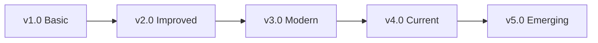

---
# Research Report Template - AI-Ready Prior Art Analysis
# Version: 1.0.0
# License: CC BY 4.0
# Purpose: Literature review, prior art, technical feasibility study

meta:
  version: "1.0.0"
  template_name: "research_prior_art"
  id: "RES-XXXX"
  title: "Research: [Topic/Technology/Problem]"
  type: "research"
  date: "YYYY-MM-DD"
  author: "@handle"
  reviewers: ["@reviewer1"]
  complexity: "auto"  # lite|standard|deep|auto
  research_type: "exploratory|comparative|feasibility|survey"
  
research_scope:
  domains: ["technology", "methodology", "tools"]
  time_frame: "last_2_years"  # last_year|last_2_years|last_5_years|all_time
  min_sources: 5
  max_sources: 15
---

# Research: [Topic/Technology/Problem]

## AI Research Instructions

> **For AI Agents:** You are conducting systematic research on prior art and existing solutions.
> 
> 1. **Search Strategy**: Use academic, industry, and open-source sources
> 2. **Evaluate Sources**: Prioritize authoritative, recent, relevant sources
> 3. **Synthesize Findings**: Identify patterns, consensus, controversies
> 4. **Gap Analysis**: What's missing in current solutions
> 5. **Evidence Collection**:
>    - Cite all sources properly
>    - Include performance benchmarks where available
>    - Note implementation complexity
> 6. **Depth Control**:
>    - Lite: 5-7 sources, key findings (d2 pages)
>    - Standard: 8-12 sources, detailed analysis (d4 pages)
>    - Deep: 12-15 sources, comprehensive survey (d6 pages)
> 7. **Critical Analysis**: Don't just summarize - evaluate and compare
> 8. **Actionable Output**: End with clear recommendations

## Executive Summary

### Research Question
<!-- What specific question are we answering? -->

### Key Findings
1. **Finding**: [Most important discovery]
2. **Finding**: [Critical insight]
3. **Finding**: [Surprising result]

### Recommendation
<!-- One paragraph - what should we do based on this research -->

## Research Methodology

### Search Strategy
- **Databases**: [Google Scholar, IEEE, ACM, arXiv]
- **Keywords**: `keyword1`, `keyword2`, `keyword3`
- **Inclusion Criteria**: 
  - Published after YYYY
  - Peer-reviewed or industry-standard
  - Relevant to [specific aspect]
- **Exclusion Criteria**:
  - Vendor marketing materials
  - Outdated (>5 years) unless seminal

### Source Distribution
| Type | Count | Weight |
|------|-------|--------|
| Academic Papers | X | 40% |
| Industry Reports | Y | 30% |
| Open Source Projects | Z | 20% |
| Standards/RFCs | W | 10% |

## Literature Review

### Current State of the Art

#### Technology/Approach: [Name]
- **Source**: [Citation]
- **Key Concept**: [What it does]
- **Strengths**: [What works well]
- **Limitations**: [Known issues]
- **Adoption**: [Who uses it, scale]
- **Performance**: [Metrics if available]

#### Technology/Approach: [Name]
<!-- Repeat for each major approach -->

### Comparative Analysis

| Approach | Performance | Complexity | Cost | Maturity | Our Fit |
|----------|------------|------------|------|----------|----------|
| Option A | High | Medium | $$$ | Stable | 8/10 |
| Option B | Medium | Low | $$ | Beta | 6/10 |
| Option C | Low | Low | $ | Mature | 4/10 |

### Evolution Timeline


## Case Studies

### Case Study 1: [Company/Project]
- **Context**: [What they were solving]
- **Solution**: [What they implemented]
- **Results**: [Quantified outcomes]
- **Lessons**: [What we can learn]
- **Source**: [Citation]

### Case Study 2: [Company/Project]
<!-- Repeat for relevant case studies -->

### Success Patterns
<!-- Common factors in successful implementations -->
1. **Pattern**: [What successful projects do]
2. **Pattern**: [Common approach]
3. **Pattern**: [Best practice]

### Failure Patterns
<!-- Common pitfalls to avoid -->
1. **Anti-pattern**: [What failed projects did]
2. **Anti-pattern**: [Common mistake]
3. **Anti-pattern**: [What to avoid]

## Technical Analysis

### Performance Benchmarks
| Solution | Metric 1 | Metric 2 | Metric 3 | Source |
|----------|----------|----------|----------|--------|
| Solution A | 100ms | 10K RPS | 99.9% | [Study 1] |
| Solution B | 150ms | 8K RPS | 99.5% | [Study 2] |
| Baseline | 500ms | 1K RPS | 95% | Industry avg |

### Complexity Assessment
- **Implementation Complexity**: [Low|Medium|High]
  - **Evidence**: [Why this rating]
- **Operational Complexity**: [Low|Medium|High]
  - **Evidence**: [Maintenance needs]
- **Learning Curve**: [Gentle|Moderate|Steep]
  - **Evidence**: [Training requirements]

### Cost Analysis
| Component | Build | Buy | Open Source |
|-----------|-------|-----|-------------|
| Initial | $XXK | $YYK | $0 |
| Annual | $XXK | $YYK | $ZK |
| TCO (3yr) | $XXK | $YYK | $ZK |

## Gap Analysis

### Market Gaps
1. **Gap**: [What no solution addresses]
   - **Evidence**: [How we know]
   - **Opportunity**: [Could we fill this?]

### Technical Gaps
1. **Gap**: [Missing capability]
   - **Impact**: [Why it matters]
   - **Difficulty**: [How hard to solve]

### Our Specific Needs vs Available Solutions
| Our Need | Best Available | Gap | Priority |
|----------|----------------|-----|----------|
| Requirement 1 | Solution A (80%) | 20% | High |
| Requirement 2 | Solution B (60%) | 40% | Medium |

## Risk Assessment

### Technology Risks
| Risk | Probability | Impact | Mitigation |
|------|-------------|--------|------------|
| Obsolescence | Low | High | Standard choice |
| Vendor lock-in | Medium | Medium | Open standards |
| Skill shortage | Medium | High | Training plan |

### Implementation Risks
- **Risk**: [Specific concern]
  - **Evidence**: [From case studies]
  - **Mitigation**: [How to avoid]

## Recommendations

### Primary Recommendation
**Approach**: [What we should do]
- **Rationale**: [Why, based on research]
- **Evidence**: [Supporting citations]
- **Confidence**: [High|Medium|Low]

### Alternative Options
1. **Option**: [Fallback approach]
   - **When to use**: [Conditions]
   - **Trade-offs**: [What we sacrifice]

### Implementation Guidance
1. **Step 1**: [Based on successful patterns]
2. **Step 2**: [Avoiding failure patterns]
3. **Step 3**: [Filling identified gaps]

### Knowledge Gaps to Address
- [ ] Research area needing more investigation
- [ ] Proof of concept needed
- [ ] Expert consultation recommended

## Future Trends

### Emerging Technologies
- **Technology**: [What's coming]
  - **Timeline**: [When available]
  - **Impact**: [How it changes things]
  - **Source**: [Industry report]

### Industry Direction
<!-- Where the industry is heading -->

## Citations

### Primary Sources
1. **[P1]** Title - Authors, Journal/Conference, Year
   - URL: [link]
   - Key Finding: [What we learned]
   - Reliability: [High|Medium|Low]

2. **[P2]** Title - Authors, Source, Year
   <!-- Continue for all primary sources -->

### Secondary Sources
1. **[S1]** Title - Organization, Year
   <!-- Blog posts, white papers, documentation -->

### Data Sources
1. **[D1]** Dataset/Benchmark - Provider, Year
   <!-- Performance data, benchmarks -->

## Research Validation

### Quality Checklist
- [ ] Minimum source count met (e5)
- [ ] Sources from multiple perspectives
- [ ] Recent sources included (<2 years)
- [ ] Authoritative sources verified
- [ ] Conflicting views addressed
- [ ] Gaps clearly identified

### Bias Check
- [ ] Vendor bias minimized
- [ ] Geographic diversity considered
- [ ] Multiple methodologies reviewed
- [ ] Negative results included

## Appendices

### Search Queries Used
```
1. "technology X" AND performance benchmark site:ieee.org
2. "problem Y" solutions comparison 2023..2024
3. "approach Z" case study implementation
```

### Excluded Studies
| Study | Reason for Exclusion |
|-------|---------------------|
| Paper A | Outdated (2018) |
| Report B | Vendor bias |
| Article C | Not peer-reviewed |

### Glossary
- **Term**: Definition
- **Acronym**: Expansion

## Next Steps

### Immediate Actions
1. [ ] Share findings with team
2. [ ] Validate assumptions with POC
3. [ ] Consult domain expert on [specific area]

### Feed Into Next Phase
- **’ PLAN**: Use cost/timeline estimates
- **’ DISCOVERY**: Focus on gap areas
- **’ PROPOSAL**: Base solution on recommendations

---

## Profile Guidelines

### Lite Profile (d2 pages)
- Focus: Key findings and recommendation
- Sources: 5-7 most relevant
- Use for: Quick technology assessment

### Standard Profile (d4 pages)
- Focus: Comprehensive analysis with case studies
- Sources: 8-12 diverse sources
- Use for: Technology selection, feasibility study

### Deep Profile (d6 pages)
- Focus: Academic-level survey
- Sources: 12-15 including primary research
- Use for: Strategic decisions, new domains

---

*Template Version: 1.0.0 | Research Framework | CC BY 4.0 License*