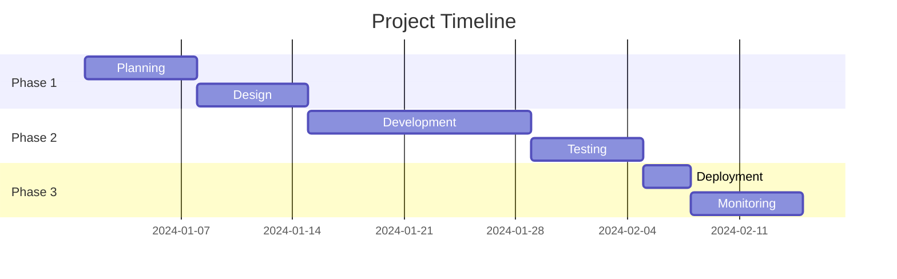
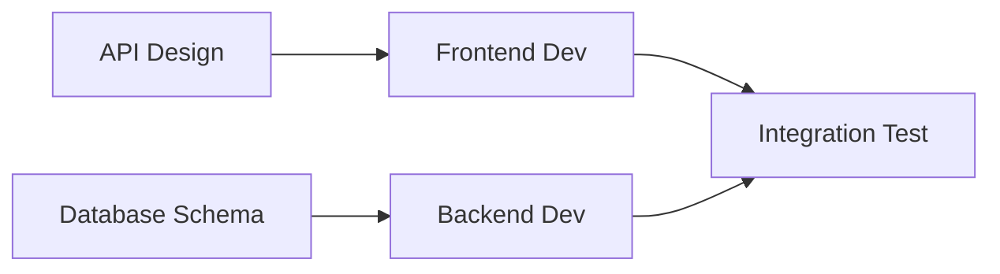

---
# Strategic Plan Template - AI-Ready Project Planning
# Version: 1.0.0
# License: CC BY 4.0
# Purpose: Strategic approach, milestones, resource allocation, success metrics
#
# FILE NAMING CONVENTION:
# When saving this completed template, use:
# TEMPLATE_NUM="01"  # This template number
# DATE=$(date +%Y-%m-%d)  # YYYY-MM-DD format
# TIME=$(date +%H%M%S)    # HHMMSS format
# FEATURE="feature_name"  # Replace with actual feature (lowercase, underscores)
# FILENAME="${TEMPLATE_NUM}_${DATE}_${TIME}_${FEATURE}_plan.md"
# Example: 01_2025-09-09_213607_visual_component_capture_plan.md

meta:
  version: "1.0.0"
  template_name: "strategic_plan"
  id: "PLAN-XXXX"
  title: "Plan: [Project/Feature Name]"
  type: "plan"
  date: "YYYY-MM-DD"
  author: "@handle"
  stakeholders: ["@sponsor", "@lead", "@reviewer"]
  complexity: "auto"  # lite|standard|deep|auto
  duration: "XX weeks"
  
planning_context:
  research_ref: "RES-XXXX"  # Optional research document
  discovery_ref: "DISC-XXXX"  # Optional discovery document  
  constraints: ["time", "budget", "resources"]
  planning_horizon: "quarter|half_year|year"
---

# Strategic Plan: [Project/Feature Name]

## AI Planning Instructions

> **For AI Agents:** You are creating a strategic project plan.
> 
> 1. **Synthesize Inputs**: Use research and discovery findings
> 2. **Break Down Work**: Create WBS with clear deliverables
> 3. **Estimate Realistically**: Use evidence-based estimates
> 4. **Identify Dependencies**: Map critical path
> 5. **Resource Planning**: Match skills to tasks
> 6. **Risk Planning**: Identify and mitigate risks
> 7. **Depth Control**:
>    - Lite: High-level milestones (d2 pages)
>    - Standard: Detailed phases and resources (d4 pages)
>    - Deep: Comprehensive with scenarios (d6 pages)
> 8. **Success Metrics**: Define measurable outcomes

## Executive Summary

### Vision Statement
<!-- One sentence describing the end state -->

### Strategic Objectives
1. **Objective**: [SMART goal]
   - **Key Result**: [Measurable outcome]
2. **Objective**: [SMART goal]
   - **Key Result**: [Measurable outcome]

### Success Metrics
| Metric | Baseline | Target | Measurement |
|--------|----------|--------|-------------|
| Metric 1 | Current | Goal | How measured |
| Metric 2 | Current | Goal | How measured |

## Project Scope

### In Scope
- [ ] Deliverable 1
- [ ] Deliverable 2
- [ ] Deliverable 3

### Out of Scope
- [ ] Explicitly excluded item
- [ ] Future phase item

### Assumptions
- Assumption about resources
- Assumption about dependencies
- Assumption about timeline

## Work Breakdown Structure

### Phase 1: [Name] (Weeks 1-X)
#### Deliverables
- **D1.1**: [Deliverable name]
  - Owner: @person
  - Effort: X days
  - Dependencies: None
  
#### Milestones
- **M1**: [Milestone name] - Week X
  - Success Criteria: [How we know it's done]

### Phase 2: [Name] (Weeks X-Y)
<!-- Continue pattern -->

### Phase 3: [Name] (Weeks Y-Z)
<!-- Continue pattern -->

## Timeline

### Gantt Chart

### Critical Path
1. Task A � Task B � Task C
2. Parallel: Task D, Task E
3. Task C + Task D � Task F

### Key Dates
| Date | Event | Deliverable |
|------|-------|-------------|
| YYYY-MM-DD | Kickoff | Project charter |
| YYYY-MM-DD | Design Review | Architecture doc |
| YYYY-MM-DD | MVP Complete | Working prototype |
| YYYY-MM-DD | Launch | Production release |

## Resource Plan

### Team Composition
| Role | Person | Allocation | Period |
|------|--------|------------|--------|
| Tech Lead | @person | 100% | Full project |
| Developer | @person | 75% | Phase 2-3 |
| Tester | @person | 50% | Phase 3 |

### Skill Requirements
- **Required**: Skills currently on team
- **Gap**: Skills needing training/hiring
- **Nice-to-have**: Skills that would accelerate

### Budget Allocation
| Category | Amount | Percentage |
|----------|--------|------------|
| Development | $XXK | 60% |
| Infrastructure | $XXK | 20% |
| Testing | $XXK | 10% |
| Contingency | $XXK | 10% |
| **Total** | **$XXK** | **100%** |

## Risk Management

### Risk Register
| Risk | Probability | Impact | Response | Owner |
|------|-------------|--------|----------|-------|
| Technical complexity | High | High | Mitigate: POC first | @techlead |
| Resource availability | Medium | High | Accept: Adjust timeline | @manager |
| Integration issues | Low | Medium | Transfer: Vendor support | @architect |

### Mitigation Strategies
1. **Risk**: [Specific risk]
   - **Early Warning**: [How we'll know]
   - **Mitigation**: [Preventive action]
   - **Contingency**: [If it happens]

## Dependencies

### Internal Dependencies

### External Dependencies
| Dependency | Provider | Required By | Status |
|------------|----------|-------------|--------|
| Auth Service | Platform Team | Phase 2 | Confirmed |
| Cloud Resources | IT Ops | Phase 1 | Pending |

## Communication Plan

### Stakeholder Matrix
| Stakeholder | Interest | Influence | Communication |
|-------------|----------|-----------|---------------|
| Sponsor | High | High | Weekly 1:1 |
| Users | High | Medium | Bi-weekly demo |
| Ops Team | Medium | Medium | Monthly update |

### Reporting Schedule
- **Daily**: Team standup
- **Weekly**: Status report to sponsors
- **Bi-weekly**: Demo to stakeholders
- **Monthly**: Metrics review

## Quality Plan

### Quality Gates
| Phase | Gate | Criteria | Approver |
|-------|------|----------|----------|
| Design | Architecture Review | Standards met | @architect |
| Development | Code Review | 100% reviewed | @techlead |
| Testing | Test Complete | >90% coverage | @qa_lead |
| Release | Go/No-Go | All criteria met | @sponsor |

### Testing Strategy
- **Unit Testing**: During development
- **Integration Testing**: End of Phase 2
- **Performance Testing**: Before release
- **User Acceptance**: Phase 3

## Success Criteria

### Definition of Done
- [ ] All acceptance criteria met
- [ ] Tests passing (>90% coverage)
- [ ] Documentation complete
- [ ] Security review passed
- [ ] Performance targets met

### Launch Criteria
- [ ] Production environment ready
- [ ] Monitoring in place
- [ ] Runbooks documented
- [ ] Team trained
- [ ] Rollback plan tested

## Contingency Plans

### Schedule Contingency
- **Buffer**: 15% added to estimates
- **Fast-track options**: Features that can be deferred
- **Crash options**: Additional resources available

### Scope Contingency
- **MVP Features**: Must have for launch
- **Nice-to-have**: Can defer to v2
- **Future**: Backlog for later

## Metrics & Monitoring

### Progress Metrics
- Velocity: Story points per sprint
- Burn rate: Budget consumed vs planned
- Quality: Defect rate
- Risk: Issues materialized

### Success Metrics
<!-- How we measure success post-launch -->
- User adoption rate
- Performance improvements
- Cost savings
- Quality metrics

## Approval & Sign-off

### Approvals Needed
- [ ] Budget approval - @finance
- [ ] Resource allocation - @resource_manager
- [ ] Technical approach - @architect
- [ ] Timeline - @sponsor

## Next Steps

### Immediate Actions (This Week)
1. [ ] Finalize team composition
2. [ ] Set up project workspace
3. [ ] Schedule kickoff meeting

### Phase 1 Preparation
1. [ ] Detailed Phase 1 planning
2. [ ] Environment setup
3. [ ] Tool procurement

---

## Profile Guidelines

### Lite Profile (d2 pages)
- Focus: Milestones and timeline
- Omit: Detailed WBS, risk register
- Use for: Small projects, quick initiatives

### Standard Profile (d4 pages)
- Focus: Complete plan with resources
- Include: WBS, risks, dependencies
- Use for: Feature development, standard projects

### Deep Profile (d6 pages)
- Focus: Comprehensive planning
- Include: Multiple scenarios, detailed risks
- Use for: Major initiatives, complex projects

---

*Template Version: 1.0.0 | Planning Framework | CC BY 4.0 License*