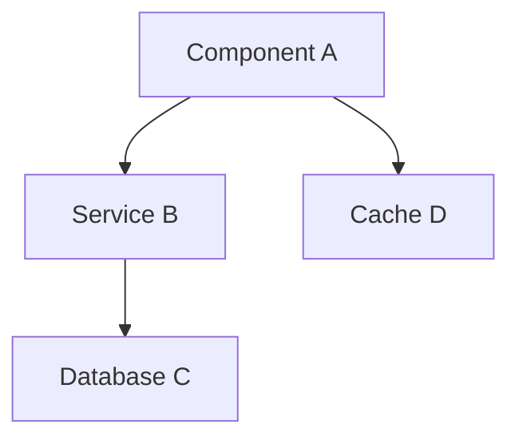
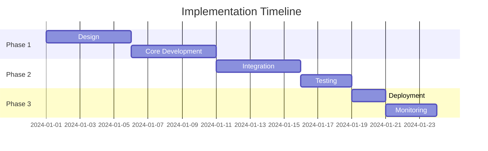

<!--
📁 FILE: /home/anthonycalek/projects/tmops_framework/CODE/tmops-header-standardization/tmops_v6_portable/templates/03_proposal_template.md
🎯 PURPOSE: Template for solution design proposals with AI instructions for alternatives, trade-offs, and decision documentation
🤖 AI-HINT: Use for solution design phase with structured methodology for architectural decision making
🔗 DEPENDENCIES: Discovery reports, research findings, proposal workflow
📝 CONTEXT: Part of template library for standardized solution proposal documentation with AI-ready design structure
-->

---
# Solution Proposal Template - AI-Ready Design Documentation
# Version: 1.0.0
# License: CC BY 4.0
# Purpose: Solution design with alternatives, trade-offs, and decisions

meta:
  version: "1.0.0"
  template_name: "solution_proposal"
  id: "PROP-XXXX"
  title: "Proposal: [Solution Name]"
  type: "proposal"
  date: "YYYY-MM-DD"
  author: "@handle"
  reviewers: ["@reviewer1", "@reviewer2"]
  complexity: "auto"  # lite|standard|deep|auto
  decision_type: "reversible|irreversible"
  
proposal_context:
  discovery_ref: "DISC-XXXX"  # Link to discovery document
  requirements_ref: ["REQ-001", "REQ-002"]
  deadline: "YYYY-MM-DD"
  budget: "XX person-days"
---

# Proposal: [Solution Name]

## AI Proposal Instructions

> **For AI Agents:** You are creating a solution proposal with alternatives.
> 
> 1. **Synthesize Discovery**: Use findings from discovery phase
> 2. **Generate Options**: Create 2-3 viable alternatives
> 3. **Analyze Trade-offs**: Quantify pros/cons with evidence
> 4. **Make Recommendation**: Clear, justified recommendation
> 5. **Risk Assessment**: Identify and mitigate risks
> 6. **Evidence Requirements**:
>    - Reference benchmarks, case studies, documentation
>    - Include performance projections
>    - Cost-benefit analysis with numbers
> 7. **Depth Control**:
>    - Lite: Single option, key trade-offs (d2 pages)
>    - Standard: 2-3 options, detailed analysis (d4 pages)
>    - Deep: Multiple options, comprehensive study (d6 pages)
> 8. **Decision Framework**: Use decision matrices, scoring systems

## Executive Summary

### Problem Statement
<!-- From discovery - what needs solving -->

### Proposed Solution
<!-- One paragraph description of recommended approach -->

### Key Benefits
1. **Benefit**: [Quantified improvement]
2. **Benefit**: [Measurable outcome]
3. **Benefit**: [Strategic advantage]

### Decision Required
- **Type**: [Reversible|Irreversible]
- **Deadline**: [Date]
- **Approvers**: [@stakeholder1, @stakeholder2]

## Context & Constraints

### Discovery Findings
<!-- Key findings from DISC-XXXX that inform this proposal -->
- **Finding 1**: [Relevant discovery]
- **Finding 2**: [Technical constraint]
- **Finding 3**: [Existing limitation]

### Requirements Addressed
| Requirement | Priority | How Addressed |
|-------------|----------|---------------|
| REQ-001 | MUST | Solution component X |
| REQ-002 | SHOULD | Solution component Y |
| REQ-003 | MAY | Future enhancement |

### Constraints
- **Technical**: [Platform, compatibility, etc.]
- **Resource**: [Time, budget, team size]
- **Business**: [Compliance, policies, SLAs]

## Solution Options

### Option 1: [Recommended] [Name]

#### Overview
<!-- 2-3 paragraph description -->

#### Architecture


#### Implementation Approach
1. **Phase 1**: [What and when]
2. **Phase 2**: [What and when]
3. **Phase 3**: [What and when]

#### Pros
-  **Pro 1**: [Quantified benefit]
-  **Pro 2**: [Evidence-backed advantage]
-  **Pro 3**: [Strategic alignment]

#### Cons
- L **Con 1**: [Honest limitation]
- L **Con 2**: [Trade-off made]

#### Cost Analysis
| Item | Effort | Cost |
|------|--------|------|
| Development | XX days | $YYYY |
| Testing | XX days | $YYYY |
| Deployment | XX days | $YYYY |
| **Total** | **XX days** | **$YYYY** |

### Option 2: [Alternative] [Name]

#### Overview
<!-- Why this is a viable alternative -->

#### Architecture
<!-- Simplified architecture diagram -->

#### Pros & Cons Summary
| Pros | Cons |
|------|------|
|  Lower cost | L Higher maintenance |
|  Faster delivery | L Less scalable |

#### Cost Analysis
- **Total Effort**: XX days
- **Total Cost**: $YYYY

### Option 3: [Minimal] Do Nothing / Defer

#### Implications
- **Risk**: [What happens if we don't act]
- **Cost**: [Cost of inaction]
- **Timeline**: [When this becomes critical]

## Decision Matrix

### Scoring Criteria
| Criterion | Weight | Option 1 | Option 2 | Option 3 |
|-----------|--------|----------|----------|----------|
| Meets Requirements | 30% | 9/10 | 7/10 | 2/10 |
| Cost Effectiveness | 25% | 7/10 | 9/10 | 10/10 |
| Time to Market | 20% | 8/10 | 9/10 | 10/10 |
| Scalability | 15% | 9/10 | 6/10 | 3/10 |
| Maintainability | 10% | 8/10 | 6/10 | 5/10 |
| **Weighted Total** | **100%** | **8.2** | **7.5** | **5.8** |

### Recommendation Rationale
<!-- Why Option 1 scores highest -->

## Risk Analysis

### Risk Matrix
| Risk | Probability | Impact | Mitigation |
|------|-------------|--------|------------|
| Performance degradation | Medium | High | Load testing, caching |
| Integration failure | Low | High | Phased rollout |
| Scope creep | High | Medium | Fixed requirements |
| Team expertise gap | Medium | Medium | Training, documentation |

### Risk Mitigation Plan
1. **Risk**: [Specific risk]
   - **Mitigation**: [Specific action]
   - **Owner**: [@person]
   - **Deadline**: [Date]

## Implementation Plan

### High-Level Timeline


### Milestones
| Milestone | Date | Deliverable |
|-----------|------|-------------|
| M1: Design Complete | YYYY-MM-DD | Architecture docs |
| M2: MVP Ready | YYYY-MM-DD | Core functionality |
| M3: Production Ready | YYYY-MM-DD | Full solution |

### Resource Requirements
- **Team**: X developers, Y testers
- **Infrastructure**: [Servers, services needed]
- **Tools**: [Software, licenses required]

## Technical Design

### Component Specification
<!-- For recommended option only -->

#### Component: [Name]
- **Responsibility**: [Single responsibility]
- **Interface**: [API/Protocol]
- **Dependencies**: [What it needs]
- **Performance**: [Expected metrics]

### Data Model
```sql
-- Key schema changes
CREATE TABLE new_table (
    id UUID PRIMARY KEY,
    field1 VARCHAR(255),
    created_at TIMESTAMP
);
```

### API Changes
```yaml
endpoint: /api/v2/resource
method: POST
request:
  - field1: string
  - field2: number
response:
  - id: uuid
  - status: string
```

## Success Criteria

### Acceptance Criteria
- [ ] All requirements met
- [ ] Performance targets achieved
- [ ] Security scan passed
- [ ] Documentation complete

### Key Metrics
| Metric | Baseline | Target | Measurement |
|--------|----------|--------|-------------|
| Response Time | 500ms | 200ms | p95 latency |
| Throughput | 100 RPS | 500 RPS | Load test |
| Error Rate | 2% | <0.5% | Monitoring |

### Definition of Success
<!-- What does success look like 3 months post-deployment -->

## Alternatives Considered

### Rejected Options
1. **Option**: [What was considered]
   - **Reason Rejected**: [Why it won't work]
   - **Evidence**: [Data/research supporting rejection]

### Future Considerations
<!-- Options that might be viable later -->

## Evidence & Research

### Benchmarks
| Solution | Metric 1 | Metric 2 | Source |
|----------|----------|----------|--------|
| Our Option 1 | XX | YY | Internal test |
| Competitor A | XX | YY | [Citation] |
| Industry Avg | XX | YY | [Citation] |

### Case Studies
1. **Company X**: Implemented similar solution
   - **Result**: 40% improvement
   - **Source**: [Link/Citation]

### Technical References
1. **[REF-1]** Design Pattern - Author, 2024; URL
2. **[REF-2]** Performance Study - Publisher, 2023; URL
3. **[REF-3]** Security Best Practices - Org, 2024; URL

## Stakeholder Alignment

### Stakeholder Feedback
| Stakeholder | Concern | How Addressed |
|-------------|---------|---------------|
| Engineering | Complexity | Phased approach |
| Product | Time to market | MVP first |
| Security | Compliance | Built-in controls |

### Approval Chain
1. **Technical Review**: [@tech_lead]
2. **Architecture Review**: [@architect]
3. **Final Approval**: [@decision_maker]

## Decision Record

### Proposed Architecture Decision Record (ADR)
```markdown
# ADR-XXX: [Decision Title]
Status: Proposed
Date: YYYY-MM-DD

## Context
[Problem description]

## Decision
We will implement Option 1 because...

## Consequences
- Positive: [Benefits]
- Negative: [Trade-offs]
- Neutral: [Side effects]
```

## Validation Checklist

### Proposal Completeness
- [ ] All options analyzed
- [ ] Trade-offs quantified
- [ ] Risks identified and mitigated
- [ ] Costs estimated
- [ ] Timeline defined
- [ ] Success criteria clear

### Evidence Quality
- [ ] 3+ external references cited
- [ ] Benchmarks included
- [ ] Case studies referenced
- [ ] Metrics projected
- [ ] Assumptions stated

## Next Steps

### Immediate Actions
1. [ ] Review with stakeholders
2. [ ] Address feedback
3. [ ] Get approvals
4. [ ] Create TASK_SPEC from approved option

### Dependencies
- **Prerequisite**: [What must happen first]
- **Blocker**: [What could stop progress]

---

## Profile Guidelines

### Lite Profile (d2 pages)
- Focus: Single recommended option
- Omit: Detailed alternatives, extensive research
- Use for: Small changes, obvious solutions

### Standard Profile (d4 pages)
- Focus: 2-3 options with trade-offs
- Include: Decision matrix, cost analysis
- Use for: Feature additions, refactoring

### Deep Profile (d6 pages)
- Focus: Comprehensive analysis
- Include: Multiple options, detailed research, risk analysis
- Use for: Architecture changes, high-stakes decisions

---

*Template Version: 1.0.0 | Proposal Framework | CC BY 4.0 License*