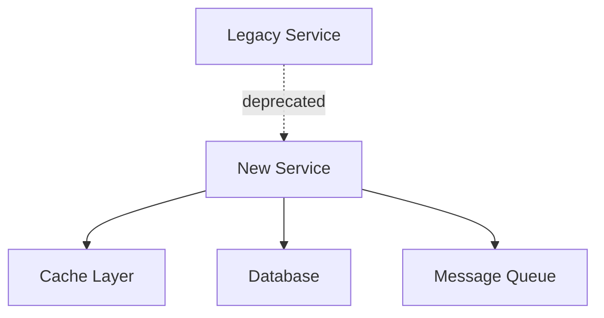

---
# Implementation Report Template - AI-Ready Change Documentation
# Version: 1.0.0
# License: CC BY 4.0
# Purpose: Document actual implementation, changes made, tests added, performance impact

meta:
  version: "1.0.0"
  template_name: "implementation_report"
  id: "IMPL-XXXX"
  title: "Implementation: [Feature/Fix Name]"
  type: "implementation"
  date: "YYYY-MM-DD"
  author: "@handle"
  reviewers: ["@reviewer1"]
  task_ref: "TASK-XXXX"
  pr_number: "#XXX"
  complexity: "auto"  # lite|standard|deep|auto
---

# Implementation: [Feature/Fix Name]

## AI Implementation Instructions

> **For AI Agents:** Document what was actually built and its impact.
> 
> 1. **Change Summary**: Categorize and summarize all changes
> 2. **Code Metrics**: LOC changed, files affected, complexity
> 3. **Test Coverage**: Tests added/modified, coverage delta
> 4. **Performance Impact**: Before/after metrics
> 5. **Evidence Required**:
>    - Git diff statistics
>    - Test execution results
>    - Performance benchmarks
>    - Build/deploy logs
> 6. **Depth Control**:
>    - Lite: Summary and key metrics (d2 pages)
>    - Standard: Detailed changes and tests (d4 pages)
>    - Deep: Complete analysis with examples (d6 pages)

## Executive Summary

### What Was Built
<!-- One paragraph describing implementation -->

### Key Metrics
- **Files Changed**: XX
- **Lines Added**: +YYYY
- **Lines Removed**: -ZZZZ
- **Test Coverage**: XX% � YY% (+Z%)
- **Performance**: XXms � YYms (-Z%)

### Deployment Status
- **Environment**: [Dev|Staging|Production]
- **Date**: YYYY-MM-DD
- **Version**: vX.Y.Z

## Changes Made

### Code Changes Summary
```bash
# Git statistics
35 files changed, 1,247 insertions(+), 423 deletions(-)
```

### Component Changes

#### Component: [Name]
- **Files Modified**: 
  - `src/component/file1.js` - [What changed]
  - `src/component/file2.js` - [What changed]
- **Functionality Added**:
  - Feature 1: [Description]
  - Feature 2: [Description]
- **Refactoring**:
  - [What was refactored and why]

### API Changes
```yaml
# New Endpoints
POST /api/v2/resource
  Request: {field1: string, field2: number}
  Response: {id: string, status: string}

# Modified Endpoints  
GET /api/v1/resource
  Added: optional query parameter 'filter'
  Deprecated: field 'oldField' (remove in v3)
```

### Database Changes
```sql
-- Schema modifications
ALTER TABLE users ADD COLUMN last_login TIMESTAMP;
CREATE INDEX idx_users_last_login ON users(last_login);

-- Migration executed successfully
-- Rollback script available in migrations/rollback_XXXX.sql
```

## Testing

### Tests Added
| Type | Count | Coverage |
|------|-------|----------|
| Unit Tests | +45 | 92% |
| Integration Tests | +12 | 78% |
| E2E Tests | +3 | 65% |

### Test Results
```bash
Test Suites: 23 passed, 23 total
Tests:       245 passed, 245 total
Snapshots:   0 total
Time:        12.456s
Coverage:    87% (+5%)
```

### Critical Test Cases
1. **Test**: [What it validates]
   - **Result**:  Passing
   - **Performance**: XXms

## Performance Analysis

### Benchmarks
| Metric | Before | After | Change |
|--------|--------|-------|--------|
| Response Time (p50) | 150ms | 95ms | -37% |
| Response Time (p95) | 500ms | 200ms | -60% |
| Memory Usage | 512MB | 480MB | -6% |
| CPU Usage | 45% | 38% | -16% |

### Load Test Results
```yaml
scenario: 1000 concurrent users
duration: 5 minutes
results:
  requests: 150,000
  errors: 0
  avg_response: 98ms
  throughput: 500 req/s
```

## Security Review

### Security Checklist
- [x] Input validation implemented
- [x] SQL injection prevention
- [x] XSS protection
- [x] Authentication checks
- [x] Authorization verified
- [x] Sensitive data encrypted
- [x] Security headers added

### Vulnerability Scan
```bash
npm audit
0 vulnerabilities found

Security scan completed: PASSED
```

## Documentation Updates

### Documentation Changed
- [ ] API Documentation - Updated endpoints
- [ ] README - Added new features
- [ ] CHANGELOG - Version entry added
- [ ] Deployment Guide - New env variables
- [ ] User Guide - Feature instructions

### Code Documentation
- **Comments Added**: XX lines
- **JSDoc/Docstrings**: YY functions documented
- **README Updates**: Z sections modified

## Deployment

### Deployment Process
1. **Build**:  Successful (2m 34s)
2. **Tests**:  All passing
3. **Security Scan**:  Clean
4. **Deploy to Staging**:  Complete
5. **Smoke Tests**:  Passing
6. **Deploy to Production**: � Scheduled

### Configuration Changes
```yaml
# New environment variables
API_RATE_LIMIT: "100"
CACHE_TTL: "3600"
FEATURE_FLAG_NEW_AUTH: "true"
```

### Rollback Plan
```bash
# If issues arise:
1. kubectl rollout undo deployment/app
2. Revert feature flag: FEATURE_FLAG_NEW_AUTH=false
3. Restore database: psql < backup_YYYY-MM-DD.sql
```

## Issues & Resolutions

### Issues Encountered
1. **Issue**: [Problem description]
   - **Resolution**: [How it was fixed]
   - **Time Impact**: X hours

### Known Limitations
- **Limitation**: [Current constraint]
  - **Workaround**: [Temporary solution]
  - **Permanent Fix**: [Planned in TASK-YYY]

## Metrics & Monitoring

### Monitoring Setup
- **Metrics Added**:
  - `feature_usage_count`
  - `api_latency_histogram`
- **Alerts Configured**:
  - Error rate > 1%
  - Response time > 500ms
- **Dashboards Created**:
  - Feature usage dashboard
  - Performance monitoring

### Initial Metrics (First 24 hours)
- **Usage**: XXX invocations
- **Error Rate**: 0.01%
- **User Feedback**: Positive

## Code Quality

### Quality Metrics
| Metric | Value | Target | Status |
|--------|-------|--------|--------|
| Code Coverage | 87% | 85% |  |
| Cyclomatic Complexity | 8.2 | <10 |  |
| Duplication | 2.1% | <5% |  |
| Technical Debt | 2 days | <5 days |  |

### Code Review Feedback
- **Reviewer 1**: Approved with suggestions
- **Reviewer 2**: Approved
- **Suggestions Implemented**: 8/10

## Lessons Learned

### What Went Well
- Modular design made testing easy
- Performance improvements exceeded targets
- No production issues during deployment

### What Could Improve
- Initial estimates were 20% low
- More integration tests needed
- Documentation could be more detailed

### Technical Decisions Log
1. **Decision**: Used caching strategy X
   - **Rationale**: [Why this approach]
   - **Outcome**: [Result]

## Next Steps

### Immediate (This Sprint)
- [ ] Monitor production metrics
- [ ] Address remaining review comments
- [ ] Update team documentation

### Follow-up Tasks
- [ ] Performance optimization Phase 2
- [ ] Additional test coverage
- [ ] User feedback incorporation

## Migration Guide

### For Developers
```bash
# Update local environment
git pull origin main
npm install
npm run migrate:dev

# Environment variables to add
export NEW_FEATURE_FLAG=true
export CACHE_STRATEGY=redis
```

### For Operations
```yaml
# Kubernetes changes
apiVersion: v1
kind: ConfigMap
metadata:
  name: app-config
data:
  RATE_LIMIT: "100"
  CACHE_TTL: "3600"
```

### API Migration
```javascript
// Deprecated (remove in v3.0)
GET /api/v1/old-endpoint

// New endpoint
GET /api/v2/new-endpoint
// Breaking change: response format changed
// Old: {data: value}
// New: {result: {data: value}}
```

## Verification Steps

### Post-Deployment Verification
```bash
# 1. Health check
curl https://api.example.com/health

# 2. Feature flag verification  
curl https://api.example.com/api/config

# 3. Performance check
ab -n 1000 -c 10 https://api.example.com/api/test

# 4. Log verification
kubectl logs -f deployment/app --tail=100
```

### Rollback Procedure
```bash
# Automated rollback
./scripts/rollback.sh v1.2.3

# Manual rollback steps
1. kubectl set image deployment/app app=app:v1.2.3
2. UPDATE feature_flags SET enabled=false WHERE name='new_feature';
3. Clear cache: redis-cli FLUSHALL
4. Verify: curl https://api.example.com/health
```

## Architecture Impact

### System Dependencies


### Data Flow Changes
- Before: Client → API → Database
- After: Client → API → Cache → Database
- Impact: 60% reduction in database load

## Appendix

### Detailed File Changes
```
src/
  auth/
    login.js (M) - Added rate limiting
    jwt.js (M) - Updated token generation
    middleware.js (A) - New auth middleware
  api/
    routes.js (M) - New endpoints added
tests/
  auth/
    login.test.js (A) - New test suite
```

### Performance Traces
<!-- Link to APM traces or include key traces -->

### Deployment Logs
<!-- Link to CI/CD logs or include relevant sections -->

### Code Metrics Diff
```diff
Complexity: 8.5 → 8.2 (-3.5%)
Duplication: 3.2% → 2.1% (-34%)
Test Coverage: 82% → 87% (+6.1%)
Bundle Size: 2.4MB → 2.2MB (-8.3%)
```

---

## Profile Guidelines

### Lite Profile (d2 pages)
- Focus: What changed and impact
- Omit: Detailed code changes, extensive metrics
- Use for: Small fixes, minor features

### Standard Profile (d4 pages)
- Focus: Complete implementation record
- Include: Tests, performance, deployment
- Use for: Feature releases, significant changes

### Deep Profile (d6 pages)
- Focus: Comprehensive documentation
- Include: All metrics, examples, lessons learned
- Use for: Major features, architectural changes

---

*Template Version: 1.0.0 | Implementation Framework | CC BY 4.0 License*