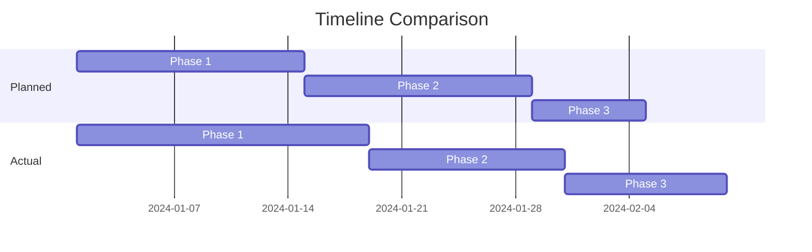
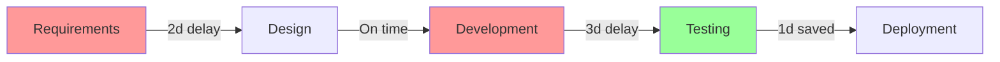

---
# Project Summary Template - AI-Ready Retrospective Analysis
# Version: 1.0.0
# License: CC BY 4.0  
# Purpose: Retrospective analysis, outcomes vs goals, metrics, lessons learned

meta:
  version: "1.0.0"
  template_name: "project_summary"
  id: "SUM-XXXX"
  title: "Summary: [Project/Feature Name]"
  type: "summary"
  date: "YYYY-MM-DD"
  author: "@handle"
  stakeholders: ["@sponsor", "@lead"]
  project_ref: "PLAN-XXXX"
  implementation_ref: "IMPL-XXXX"
  complexity: "auto"  # lite|standard|deep|auto
---

# Project Summary: [Project/Feature Name]

## AI Summary Instructions

> **For AI Agents:** Create a comprehensive project retrospective.
> 
> 1. **Compare Plan vs Actual**: Analyze deviations
> 2. **Measure Success**: Quantify against initial goals
> 3. **Extract Patterns**: Identify what worked/didn't work
> 4. **Calculate ROI**: Measure value delivered
> 5. **Evidence Required**:
>    - Original estimates vs actual
>    - Metrics achieved vs targets
>    - Timeline planned vs executed
> 6. **Be Honest**: Include failures and learnings
> 7. **Actionable Output**: Specific recommendations

## Executive Summary

### Project Outcome
- **Status**:  Complete | � Partial | L Failed
- **Delivery Date**: YYYY-MM-DD (X days late/early)
- **Budget**: $XXK spent of $YYK (Z% over/under)
- **Scope**: XX% of planned features delivered

### Key Achievements
1. **Achievement**: [Quantified success]
2. **Achievement**: [Measurable outcome]
3. **Achievement**: [Strategic win]

### Key Learnings
1. **Learning**: [What we discovered]
2. **Learning**: [Process improvement]
3. **Learning**: [Technical insight]

## Goals vs Outcomes

### Success Metrics Comparison
| Metric | Target | Achieved | Variance | Status |
|--------|--------|----------|----------|--------|
| Performance | <200ms | 150ms | -25% |  Exceeded |
| User Adoption | 1000 | 1200 | +20% |  Exceeded |
| Error Rate | <1% | 0.8% | -20% |  Met |
| Coverage | 90% | 85% | -5.5% | � Missed |

### Feature Delivery
| Feature | Planned | Delivered | Status |
|---------|---------|-----------|--------|
| Core Auth |  |  | Complete |
| Rate Limiting |  |  | Complete |
| Social Login |  | � | Partial |
| Analytics |  | L | Deferred |

## Timeline Analysis

### Planned vs Actual


### Milestone Performance
| Milestone | Planned | Actual | Variance | Reason |
|-----------|---------|--------|----------|--------|
| Kickoff | Jan 1 | Jan 1 | 0 days | On time |
| Design Complete | Jan 14 | Jan 18 | +4 days | Scope addition |
| MVP Ready | Feb 1 | Feb 5 | +4 days | Testing issues |
| Launch | Feb 15 | Feb 20 | +5 days | Performance tuning |

## Resource Utilization

### Team Performance
| Role | Planned Hours | Actual Hours | Efficiency |
|------|---------------|--------------|------------|
| Development | 320 | 380 | 84% |
| Testing | 80 | 120 | 67% |
| DevOps | 40 | 35 | 114% |
| **Total** | **440** | **535** | **82%** |

### Budget Analysis
| Category | Budget | Actual | Variance |
|----------|--------|--------|----------|
| Labor | $50K | $58K | +16% |
| Infrastructure | $10K | $8K | -20% |
| Tools/Licenses | $5K | $5K | 0% |
| **Total** | **$65K** | **$71K** | **+9%** |

## Quality Metrics

### Defect Analysis
- **Bugs Found in Dev**: 145
- **Bugs Found in Testing**: 42
- **Bugs Found in Production**: 3
- **Defect Escape Rate**: 2.1%

### Technical Debt
- **Debt Introduced**: 5 days
- **Debt Resolved**: 8 days
- **Net Improvement**: -3 days

## Performance Analysis

### System Performance
| Metric | Baseline | Target | Achieved |
|--------|----------|--------|----------|
| Load Time | 3.2s | 2.0s | 1.8s  |
| API Response | 450ms | 200ms | 150ms  |
| Concurrent Users | 100 | 500 | 600  |

### Business Impact
- **User Satisfaction**: +15% (survey)
- **Support Tickets**: -30%
- **Revenue Impact**: +$XXK/month
- **Cost Savings**: $YYK/year

## Lessons Learned

### What Went Well
1. **Success Factor**: Agile approach allowed quick pivots
   - **Evidence**: 3 major requirement changes handled
   - **Recommendation**: Continue agile methodology

2. **Success Factor**: Automated testing caught issues early
   - **Evidence**: 90% of bugs found before production
   - **Recommendation**: Increase test automation

### What Didn't Work
1. **Challenge**: Underestimated integration complexity
   - **Impact**: 4-day delay
   - **Mitigation**: Add integration spike to future projects

2. **Challenge**: Insufficient performance testing
   - **Impact**: Last-minute optimization needed
   - **Mitigation**: Performance tests in CI pipeline

### Process Improvements
1. **Improvement**: Add buffer for unknowns (20%)
2. **Improvement**: Earlier stakeholder involvement
3. **Improvement**: More frequent demos

## Team Feedback

### Survey Results
- **Team Satisfaction**: 4.2/5
- **Process Effectiveness**: 3.8/5
- **Tool Satisfaction**: 4.5/5

### Key Feedback Points
-  "Great collaboration"
-  "Clear requirements"
- � "Need better estimation"
- � "More time for refactoring"

## Risk Assessment Review

### Predicted vs Actual Risks
| Risk | Predicted | Materialized | Impact |
|------|-----------|--------------|--------|
| Technical complexity | High/High | Yes | 4-day delay |
| Resource availability | Med/High | No | None |
| Integration issues | Low/Med | Yes | 2-day delay |

## Recommendations

### For Future Projects
1. **Planning**: Add 20% buffer to all estimates
2. **Testing**: Implement performance testing early
3. **Communication**: Daily standups with stakeholders
4. **Documentation**: Maintain decision log

### Technical Recommendations
1. **Architecture**: Consider microservices for scalability
2. **Infrastructure**: Implement auto-scaling
3. **Monitoring**: Add more granular metrics

### Process Recommendations
1. **Estimation**: Use 3-point estimation
2. **Reviews**: More frequent code reviews
3. **Retrospectives**: Bi-weekly instead of monthly

## Value Delivered

### ROI Calculation
- **Investment**: $71K
- **Annual Savings**: $120K
- **Revenue Increase**: $180K
- **ROI**: 323% (first year)

### Strategic Value
- Market competitiveness improved
- Technical debt reduced
- Team capabilities enhanced
- Platform for future features

## Next Steps

### Immediate Actions
1. [ ] Document all learnings in wiki
2. [ ] Update estimation templates
3. [ ] Schedule team celebration

### Follow-up Projects
1. **Project**: Phase 2 features
   - **Priority**: High
   - **Timeline**: Q2
2. **Project**: Performance optimization
   - **Priority**: Medium
   - **Timeline**: Q3

## Organizational Learning

### Knowledge Base Updates
1. **New Pattern Documented**: [Pattern name]
   - **Context**: When to use
   - **Solution**: How to implement
   - **Example**: Code/config sample

2. **Anti-pattern Identified**: [What to avoid]
   - **Problem**: Why it's bad
   - **Alternative**: Better approach

### Process Improvements Implemented
| Process | Before | After | Impact |
|---------|--------|-------|--------|
| Code Review | 2 days avg | 4 hours avg | 75% faster |
| Testing | Manual | Automated | 90% coverage |
| Deployment | 4 hours | 30 minutes | 87% faster |

### Tool Adoption
- **New Tool**: [Tool name]
  - **Purpose**: [Why adopted]
  - **Training Status**: X/Y team members trained
  - **ROI**: Time saved, quality improved

## Stakeholder Impact Analysis

### User Impact
```yaml
users_affected: 10,000
satisfaction_delta: +15%
support_tickets_reduced: 30%
feature_adoption_rate: 65%
user_feedback_themes:
  - "Much faster now"
  - "Love the new UI"
  - "Some confusion with X"
```

### Business Impact
- **Revenue Impact**: +$XX,000/month
- **Cost Savings**: $YY,000/year
- **Market Position**: Competitive advantage in [area]
- **Customer Retention**: +Z% improvement

### Technical Impact
- **System Stability**: 99.95% uptime achieved
- **Technical Debt**: Net reduction of 3 days
- **Platform Scalability**: Can now handle 10x load
- **Developer Productivity**: 20% improvement in velocity

## Detailed Timeline Analysis

### Critical Path Analysis


### Delay Root Causes
1. **Requirements Delay (2 days)**
   - Cause: Stakeholder availability
   - Impact: Pushed entire timeline
   - Prevention: Earlier scheduling

2. **Development Delay (3 days)**
   - Cause: Unexpected complexity
   - Impact: Compressed testing
   - Prevention: Better discovery phase

## Cost-Benefit Analysis

### Detailed Cost Breakdown
```yaml
development_costs:
  labor:
    developers: $45,000
    testers: $8,000
    devops: $5,000
  infrastructure:
    cloud_resources: $3,000
    tools_licenses: $2,000
    monitoring: $1,000
  other:
    training: $1,000
    documentation: $2,000
total_cost: $67,000

benefits_year_1:
  cost_savings:
    reduced_support: $60,000
    automation_savings: $40,000
    infrastructure_optimization: $20,000
  revenue_increase:
    new_customers: $100,000
    upsell_existing: $50,000
    reduced_churn: $30,000
total_benefit: $300,000

roi_calculation:
  investment: $67,000
  return: $300,000
  roi_percentage: 348%
  payback_period: 2.7 months
```

## Technical Achievements

### Performance Improvements
```diff
Before → After (Change)
- API Latency: 450ms → 120ms (-73%)
- Database Queries: 50/req → 5/req (-90%)
- Cache Hit Rate: 40% → 85% (+112%)
- Error Rate: 0.5% → 0.05% (-90%)
- Memory Usage: 4GB → 2.5GB (-37%)
```

### Code Quality Improvements
- **Reduced Complexity**: 15.2 → 8.1 average
- **Increased Modularity**: 65% → 92% coverage
- **Better Documentation**: 40% → 95% documented
- **Automated Tests**: 145 → 487 tests

## Communication Effectiveness

### Stakeholder Communications
| Channel | Frequency | Effectiveness | Feedback |
|---------|-----------|---------------|----------|
| Daily Standups | 100% | High | "Very helpful" |
| Weekly Demos | 90% | High | "Great visibility" |
| Slack Updates | Daily | Medium | "Sometimes missed" |
| Email Reports | Weekly | Low | "Too detailed" |

### Recommendation for Future
- Increase demo frequency
- Reduce email reports
- Add dashboard for real-time status
- Implement automated notifications

## Appendices

### Detailed Metrics
[Link to metrics dashboard]

### Stakeholder Feedback
[Link to survey results]

### Post-Mortem Notes
[Link to detailed post-mortem]

### Supporting Documents
- Project Charter: [link]
- Technical Specifications: [link]
- Test Reports: [link]
- Security Audits: [link]

---

## Profile Guidelines

### Lite Profile (d2 pages)
- Focus: Key outcomes and learnings
- Use for: Small projects, quick wins

### Standard Profile (d4 pages)
- Focus: Complete analysis with metrics
- Use for: Feature releases, sprints

### Deep Profile (d6 pages)
- Focus: Comprehensive retrospective
- Use for: Major projects, quarterly reviews

---

*Template Version: 1.0.0 | Summary Framework | CC BY 4.0 License*