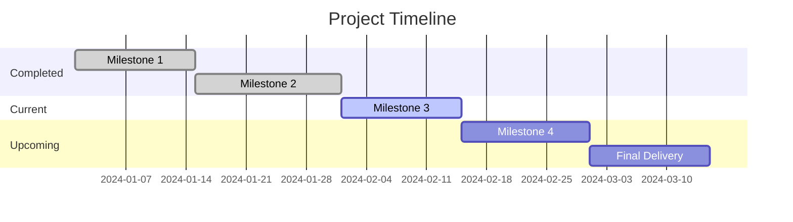

<!--
📁 FILE: /home/anthonycalek/projects/tmops_framework/CODE/tmops_v6_portable/templates/09_report_template.md
🎯 PURPOSE: Template for ongoing situation reports with AI instructions for status tracking, metrics analysis, and stakeholder communication
🤖 AI-HINT: Use for regular status reporting on ongoing situations with structured methodology for progress tracking and issue identification
🔗 DEPENDENCIES: Project tracking systems, metrics data, stakeholder communication workflow
📝 CONTEXT: Part of template library for standardized situation reporting with AI-ready analysis and communication structure
-->

---
# Situation Report Template - AI-Ready Status Communication
# Version: 1.0.0
# License: CC BY 4.0
# Purpose: Regular status reports on ongoing situations, projects, incidents, or operational states

meta:
  version: "1.0.0"
  template_name: "situation_report"
  id: "RPT-XXXX"
  title: "Report: [Situation/Project Name] - [Date]"
  type: "report"
  date: "YYYY-MM-DD"
  author: "@handle"
  distribution: ["@stakeholder1", "@stakeholder2"]
  complexity: "auto"  # lite|standard|deep|auto
  report_type: "status|incident|operational|project|escalation"
  frequency: "daily|weekly|monthly|ad_hoc|emergency"
  
report_context:
  situation_id: "PROJ-XXXX|INC-XXXX|OPS-XXXX"
  reporting_period: "YYYY-MM-DD to YYYY-MM-DD"
  previous_report: "RPT-XXXX"
  next_report_due: "YYYY-MM-DD"
---

# Situation Report: [Situation Name] - [Date]

## AI Report Instructions

> **For AI Agents:** You are creating a structured situation report.
> 
> 1. **Analyze Current State**: Assess progress, issues, and trends
> 2. **Compare vs Baseline**: Show changes from previous period
> 3. **Identify Patterns**: Spot trends, risks, and opportunities
> 4. **Prioritize Issues**: Focus on what matters most
> 5. **Evidence Required**:
>    - Quantified metrics and trends
>    - Specific examples and incidents
>    - Comparative analysis vs targets/previous periods
> 6. **Actionable Output**: Clear next steps and decisions needed
> 7. **Depth Control**:
>    - Lite: Executive summary focus (≤2 pages)
>    - Standard: Comprehensive analysis (≤4 pages)
>    - Deep: Detailed investigation (≤6 pages)
> 8. **Stakeholder-Appropriate**: Match detail level to audience needs

## Executive Summary

### Situation Status
- **Overall Status**: 🟢 On Track | 🟡 At Risk | 🔴 Critical | ⚫ Complete
- **Reporting Period**: [Start Date] to [End Date]
- **Key Metric**: [Primary success indicator] - [Current Value]
- **Confidence Level**: High | Medium | Low

### Critical Updates
1. **🔥 Critical**: [Most important development]
2. **⚠️ Risk**: [Key risk or concern]
3. **✅ Achievement**: [Notable success or milestone]

### Immediate Attention Required
- **Decision Needed**: [What needs stakeholder decision]
- **Escalation**: [Issues requiring higher-level intervention]
- **Resources**: [Critical resource needs]

## Current Status Analysis

### Progress Metrics
| Metric | Target | Current | Previous | Trend | Status |
|--------|--------|---------|----------|--------|--------|
| Completion % | 80% | 75% | 70% | ⬆️ +5% | 🟡 |
| Budget Utilization | $100K | $85K | $80K | ⬆️ +$5K | 🟢 |
| Timeline Adherence | On Time | 2 days behind | 1 day behind | ⬇️ -1d | 🟡 |
| Quality Score | 95% | 92% | 94% | ⬇️ -2% | 🟡 |

### Performance Dashboard
```yaml
current_period_summary:
  achievements: 15
  issues_resolved: 8
  new_issues: 3
  risks_mitigated: 5
  
trend_analysis:
  velocity: +12% vs last period
  quality: -3% vs baseline
  satisfaction: +8% vs last month
  efficiency: Stable
```

### Key Performance Indicators (KPIs)
- **Primary KPI**: [Main success metric] - [Value] ([Trend])
- **Secondary KPIs**:
  - [Metric 1]: [Value] ([Trend])
  - [Metric 2]: [Value] ([Trend])
  - [Metric 3]: [Value] ([Trend])

## Progress Updates

### Completed This Period
✅ **Major Accomplishments**
1. **Achievement**: [Specific accomplishment]
   - **Impact**: [How this helps overall goals]
   - **Owner**: [@person]
   - **Completed**: [Date]

2. **Milestone**: [Milestone reached]
   - **Significance**: [Why important]
   - **Next Phase**: [What this enables]

✅ **Resolved Issues**
- [Issue 1]: [How resolved] - [@resolver]
- [Issue 2]: [Resolution details] - [@resolver]

### In Progress This Period
🔄 **Active Work Streams**
1. **Work Stream**: [Current major effort]
   - **Progress**: [X% complete or specific status]
   - **Owner**: [@person]
   - **Expected Completion**: [Date]
   - **Blockers**: [None | List blockers]

2. **Initiative**: [Another active area]
   - **Status**: [Current state]
   - **Key Activities**: [What's happening now]

### Planned Next Period
📋 **Upcoming Priorities**
1. **Priority 1**: [Most important upcoming work]
   - **Timeline**: [When this will happen]
   - **Dependencies**: [What needs to happen first]
   - **Owner**: [@person]

2. **Priority 2**: [Second most important]
   - **Rationale**: [Why this is next]
   - **Resources Required**: [What's needed]

## Issues & Risks

### Current Issues
🔴 **Critical Issues**
| Issue | Impact | Status | Owner | Due Date |
|-------|--------|--------|-------|----------|
| [Critical Issue 1] | High | In Progress | @person | YYYY-MM-DD |
| [Critical Issue 2] | High | Blocked | @person | YYYY-MM-DD |

🟡 **Medium Priority Issues**
- **Issue**: [Description]
  - **Status**: [Current state]
  - **Plan**: [How being addressed]
  - **ETA**: [Expected resolution]

### Risk Assessment
| Risk | Probability | Impact | Mitigation | Owner |
|------|-------------|--------|------------|-------|
| [Risk 1] | High | High | [Mitigation strategy] | @person |
| [Risk 2] | Medium | Medium | [Prevention plan] | @person |

### Escalations
🚨 **Requiring Leadership Attention**
1. **Escalation**: [Issue needing higher-level decision]
   - **Background**: [Context and history]
   - **Options**: [Possible solutions]
   - **Recommendation**: [Preferred approach]
   - **Decision Needed By**: [Deadline]

## Resource Status

### Team Utilization
| Resource | Allocated | Utilized | Efficiency | Issues |
|----------|-----------|----------|------------|---------|
| Development | 5 FTE | 4.2 FTE | 84% | 1 person on leave |
| Testing | 2 FTE | 1.8 FTE | 90% | None |
| DevOps | 1 FTE | 1.2 FTE | 120% | Overallocated |

### Budget Tracking
```yaml
budget_status:
  total_budget: $500K
  spent_to_date: $325K
  committed: $100K
  remaining: $75K
  burn_rate: $50K/month
  projected_completion: $480K
  variance: Under budget by $20K
```

### Infrastructure & Tools
- **System Performance**: [Green/Yellow/Red] - [Details]
- **Tool Availability**: [Any outages or issues]
- **Capacity**: [Current usage vs limits]

## Stakeholder Communication

### Stakeholder Updates
| Stakeholder | Last Contact | Next Contact | Status | Issues |
|-------------|--------------|--------------|--------|---------|
| @sponsor | Yesterday | Next Monday | Satisfied | None |
| @customer | Last week | This week | Concerned | Performance questions |
| @ops_team | Daily standup | Tomorrow | Supportive | Resource questions |

### Feedback Received
📝 **Key Stakeholder Feedback**
- **@sponsor**: "[Feedback quote]"
  - **Action**: [How responding]
- **@customer**: "[Customer concern]"
  - **Response**: [How addressing]

### Communication Actions Needed
- [ ] Update customer on performance improvements
- [ ] Brief leadership on budget variance
- [ ] Coordinate with ops team on resource allocation

## Quality & Metrics

### Quality Indicators
```yaml
quality_metrics:
  defect_rate: 0.02%  # Target: <0.05%
  customer_satisfaction: 4.2/5  # Target: >4.0
  sla_compliance: 99.7%  # Target: >99.5%
  code_coverage: 87%  # Target: >85%
```

### Trend Analysis
📊 **Performance Trends (Last 4 Periods)**
```
Metric          | P-3  | P-2  | P-1  | Current | Trend
Velocity        | 45   | 48   | 52   | 55     | ⬆️ Improving
Error Rate      | 2.1% | 1.8% | 1.5% | 1.2%   | ⬆️ Improving  
Satisfaction    | 4.0  | 4.1  | 4.0  | 4.2    | ⬆️ Stable/Up
Delivery Time   | 5.2d | 4.8d | 5.1d | 4.9d   | ➡️ Stable
```

## Financial Status

### Budget Analysis
- **Budget Health**: [On track/Over/Under] by [Amount/Percentage]
- **Key Variances**: 
  - Over: [Category] by [Amount] - [Reason]
  - Under: [Category] by [Amount] - [Reason]
- **Forecast**: [Expected final cost vs budget]

### ROI/Value Tracking
- **Value Delivered**: [Quantified benefits to date]
- **ROI to Date**: [Current return calculation]
- **Projected Final ROI**: [Expected final return]

## Timeline & Milestones

### Milestone Status


### Schedule Health
- **On Track**: [X milestones]
- **At Risk**: [Y milestones] - [Reasons]
- **Behind**: [Z milestones] - [Recovery plans]

## Decisions & Actions

### Decisions Made This Period
1. **Decision**: [What was decided]
   - **Context**: [Why decision was needed]
   - **Options Considered**: [Alternatives evaluated]
   - **Rationale**: [Why this option chosen]
   - **Impact**: [Expected effects]

### Decisions Required Next Period
| Decision | Context | Options | Recommender | Due Date |
|----------|---------|---------|-------------|----------|
| [Decision 1] | [Background] | [Option A/B/C] | @person | YYYY-MM-DD |

### Action Items
| Action | Owner | Due Date | Status | Dependencies |
|--------|-------|----------|--------|--------------|
| [Action 1] | @person | YYYY-MM-DD | In Progress | None |
| [Action 2] | @person | YYYY-MM-DD | Not Started | [Dependency] |

## Recommendations

### Immediate Actions (Next 48 Hours)
1. **Action**: [What should be done immediately]
   - **Rationale**: [Why urgent]
   - **Owner**: [@person]
   - **Resources Needed**: [What's required]

### Short-term Actions (This Week)
- **Action**: [What should happen this week]
  - **Priority**: [High/Medium/Low]
  - **Impact**: [Expected benefit]

### Strategic Recommendations
- **Recommendation**: [Longer-term suggestion]
  - **Business Case**: [Why important]
  - **Timeline**: [When to implement]

## Lessons Learned

### What's Working Well
- **Success Factor 1**: [What's going right]
  - **Evidence**: [How we know]
  - **Replication**: [How to maintain/expand]

- **Success Factor 2**: [Another positive]
  - **Impact**: [Measurable benefit]

### Areas for Improvement
- **Challenge 1**: [What could be better]
  - **Root Cause**: [Why this is happening]
  - **Proposed Solution**: [How to address]

- **Challenge 2**: [Another improvement area]
  - **Action Plan**: [Steps to improve]

## Future Outlook

### Next Period Forecast
- **Expected Progress**: [What should be accomplished]
- **Anticipated Challenges**: [Known upcoming difficulties]
- **Resource Needs**: [What will be required]
- **Key Focus Areas**: [Where to prioritize attention]

### Long-term Trajectory
- **Trend Assessment**: [Where things are heading]
- **Success Probability**: [Likelihood of achieving goals]
- **Course Corrections Needed**: [Any strategy adjustments]

## Appendices

### Supporting Data
- **Detailed Metrics**: [Link to dashboard/spreadsheet]
- **Issue Tracking**: [Link to ticket system]
- **Financial Reports**: [Link to budget tracking]

### Historical Context
- **Previous Reports**: [Links to prior reports]
- **Baseline Data**: [Original targets and assumptions]
- **Change Log**: [How situation has evolved]

### Stakeholder Materials
- **Executive Summary**: [One-page version for leadership]
- **Technical Details**: [Detailed data for specialists]
- **Customer Communication**: [External-facing updates]

---

## Report Type Guidelines

### Status Reports (Regular Progress Updates)
- Focus: Progress, metrics, timeline
- Frequency: Weekly/Monthly
- Audience: Project stakeholders
- Key Sections: Progress, Issues, Next Steps

### Incident Reports (Problem Response)
- Focus: Issue analysis, impact, resolution
- Frequency: As needed/Emergency
- Audience: Technical teams, management
- Key Sections: Current Status, Root Cause, Actions

### Operational Reports (System/Service Health)
- Focus: Performance, availability, capacity
- Frequency: Daily/Weekly
- Audience: Operations teams, SRE
- Key Sections: Metrics, Issues, Capacity

### Project Reports (Development Progress)
- Focus: Deliverables, timeline, budget
- Frequency: Weekly/Bi-weekly
- Audience: Project sponsors, teams
- Key Sections: Progress, Budget, Risks

### Escalation Reports (Critical Issues)
- Focus: Problem description, options, recommendations
- Frequency: Immediate/Critical
- Audience: Leadership, decision makers
- Key Sections: Issue, Impact, Options, Recommendation

---

## Profile Guidelines

### Lite Profile (≤2 pages)
- Focus: Executive summary and key metrics
- Use for: Daily standups, brief updates
- Omit: Detailed analysis, extensive background

### Standard Profile (≤4 pages)
- Focus: Complete status with analysis
- Use for: Weekly team reports, milestone updates
- Include: Full metrics, issues, recommendations

### Deep Profile (≤6 pages)
- Focus: Comprehensive analysis and planning
- Use for: Monthly executive reports, major decisions
- Include: Trends, detailed analysis, strategic outlook

---

*Template Version: 1.0.0 | Reporting Framework | CC BY 4.0 License*